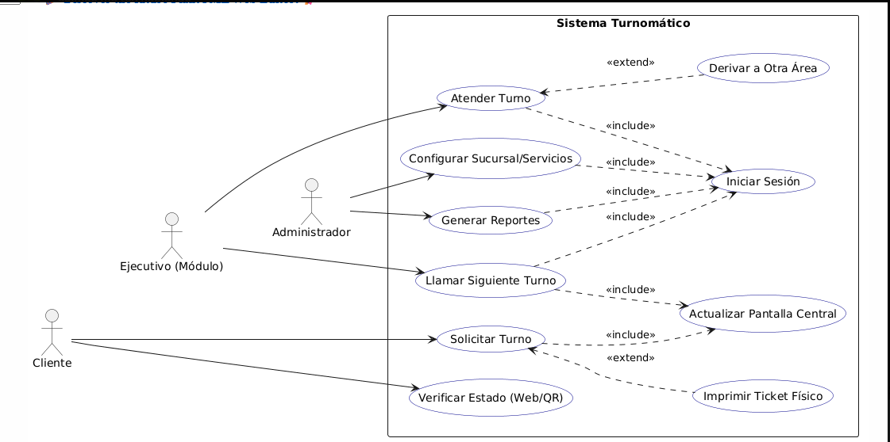
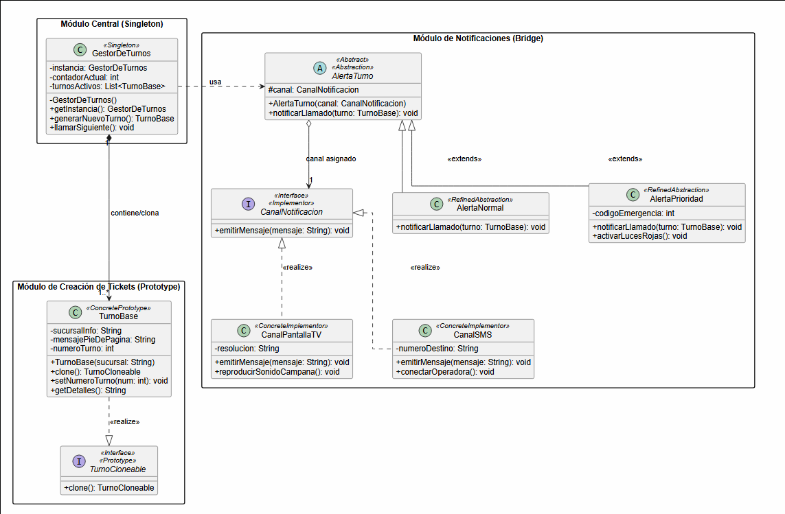
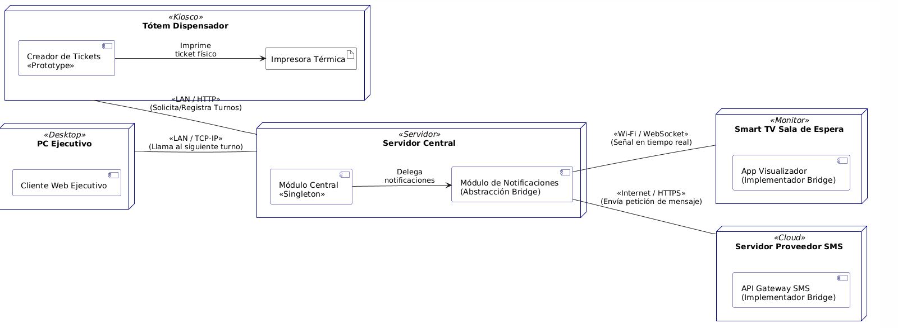

# sistema_gestion_turnos
repositorio con actividad de patrones de diseño haciendo diagramas con 3 patrones aplicados

# 1. Descripción General del Sistema
El sistema Turnomático es una solución de software empresarial diseñada para optimizar el flujo de atención al cliente en sucursales físicas. Permite la emisión automatizada de turnos desde terminales de autoservicio (tótems), la gestión activa de la cola de espera por parte de ejecutivos de atención, y la notificación multidifusión en tiempo real a través de pantallas centrales y mensajes de texto. La arquitectura de la solución prioriza la consistencia de los datos, la escalabilidad de los canales de notificación y el rendimiento óptimo de la red local.

# 2. Vista Funcional: Diagrama de Casos de Uso

# Descripción y Justificación de Relaciones

El modelo funcional divide las responsabilidades del sistema en tres actores principales conectados a través de flujos dependientes y condicionales:

* **Regla del <<include>> (Dependencia Estricta):** * Llamar Siguiente Turno, Atender Turno, Configurar Sucursal y Generar Reportes incluyen obligatoriamente el caso de uso Iniciar Sesión. Esto garantiza la seguridad del sistema en el backend, impidiendo accesos no autorizados antes de ejecutar lógica de negocio.
    * Solicitar Turno y Llamar Siguiente Turno incluyen Actualizar Pantalla Central. Esto asegura que cualquier alteración en el estado de las colas se refleje inmediatamente de forma transversal.
* **Regla del <<extend>> (Flujos Condicionales):**
    * Imprimir Ticket Físico extiende a Solicitar Turno: El flujo principal genera el turno digitalmente; la impresión física es una bifurcación opcional dependiente de la elección del cliente en el tótem.
    * Derivar a Otra Área extiende a Atender Turno: Representa un flujo de excepción que solo se ejecuta si el trámite del cliente requiere la intervención de un departamento secundario.
 

## 3. Diseño Lógico: Diagrama de Clases y Patrones

### Justificación Profunda de Patrones de Diseño

El sistema implementa tres patrones fundamentales para resolver problemas críticos de concurrencia, rendimiento y extensibilidad:

| Patrón | Clase/Módulo Aplicado | Justificación Arquitectónica |

| **Singleton (Lazy Thread-Safe)** | GestorDeTurnos | Centraliza el control de la cola de atención en una única instancia global dentro del servidor. Al implementarse de forma **Perezosa (Lazy)** con hilos seguros (*Thread-Safe* mediante bloqueo doble), se evita el uso innecesario de memoria en el arranque y se garantiza que múltiples tótems pidiendo turnos simultáneamente no generen números duplicados ni colisiones de datos. |
| **Prototype** | TurnoBase | Optimiza la creación de objetos en entornos distribuidos. El Tótem Dispensador posee un clonador de estructuras de tickets. En lugar de realizar peticiones costosas al servidor central para construir la configuración base del objeto (sucursal, textos fijos, pies de página), el nodo local clona un prototipo existente en memoria y solo actualiza los datos dinámicos (número e ID), ahorrando ancho de banda. |
| **Bridge** | AlertaTurno (Abstracción)   CanalNotificacion (Implementador) | Desacopla por completo la lógica de las alertas de los medios físicos de visualización. Permite que las abstracciones de las alertas (AlertaNormal, AlertaPrioridad) varíen de manera independiente a sus canales de salida (CanalPantallaTV, CanalSMS). Si en el futuro se añade un nuevo canal (ej. Notificación Push en App), no se modifica el código central del servidor, cumpliendo el principio Abierto/Cerrado (OCP). |

---

## 4. Arquitectura Física: Diagrama de Implementación

### Decisiones Técnicas y Distribución de Nodos

La topología de red distribuye la carga del software para mitigar puntos únicos de fallo y asegurar la latencia mínima:

* **Nodo Servidor Central:** Aloja el componente central GestorDeTurnos (Singleton) y la abstracción del Bridge. Concentra la lógica de negocio pesada y la persistencia de datos, aislando el núcleo del sistema de fallos en las terminales cliente.
* **Nodo Tótem Dispensador (Kiosco):** Ejecuta de forma local el Creador de Tickets (Prototype) conectado de manera directa a la Impresora Térmica. Se comunica con el servidor mediante el protocolo **HTTP** sobre **LAN** para registrar los turnos, garantizando autonomía operativa local.
* **Nodo Smart TV (Monitor):** Ejecuta la interfaz de visualización en la sala de espera. Utiliza una conexión dedicada por **Wi-Fi** mediante **WebSockets**. Esta decisión técnica permite una comunicación bidireccional continua (*full-duplex*) para empujar las alertas instantáneamente sin saturar la red con consultas constantes de tipo *polling*.
* **Conexiones Externas (Cloud):** El canal SMS se conecta con pasarelas de mensajería externas a través de **HTTPS** sobre **Internet**, encapsulando la API del proveedor fuera de la infraestructura local de la empresa.

## 5. Reflexiones Finales del Modelado

1.  **Trazabilidad del Diseño:** El proceso demuestra cómo los requerimientos funcionales del negocio de atención al cliente (Casos de Uso) moldean directamente las estructuras de código optimizadas (Clases) y determinan la configuración de los equipos de red y servidores (Implementación).
2.  **Sustentabilidad del Software:** La inclusión de patrones estructurales y creacionales previene el acoplamiento difuso. Modificar el hardware de las pantallas, cambiar el proveedor de mensajería o añadir nuevos tótems de autoservicio son tareas que se realizan de forma modular sin alterar el núcleo estable de la aplicación.
3.  **Concurrencia Resuelta:** El modelado físico y lógico aborda formalmente el principal desafío de los sistemas de turnos: la consistencia temporal de la información ante accesos concurrentes masivos.
